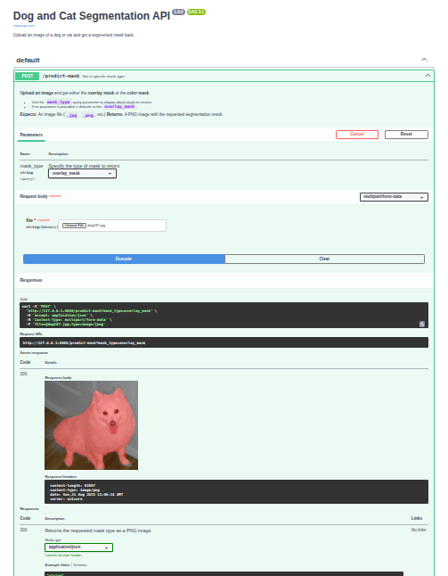

Image Segmentation API for Cats, Dogs, and Background
--
This project provides an API for segmenting images into **Cat**, **Dog**, and **Background** classes using a custom dataset. The API is built with FastAPI and can be easily deployed using Docker.
-----------------------------------------------------------------
Team Members

[Kaung Khant](https://github.com/kaungkhantcoder)

[Phoe Kit](https://github.com/Bt-PplusK)

[Nobel Lin Tun](https://github.com/sleepynob)


-----------------------------------

🚀 **Features**

*Object Segmentation*: Accurately segments images into three distinct classes: Cat, Dog, and Background.

*Image-to-Mask Conversion*: Accepts an image input and returns a detailed segmentation mask.

*Easy Deployment*: The API is fully Dockerized for a smooth and consistent deployment process.

*Custom Dataset*: Powered by a unique dataset of 401 images that were meticulously created and annotated by our team.
---------------------------------------------------

****Project Structure****
```
.
├── Cat_And_Dog.ipynb
├── Dataset
│   └── cat_and_dog.zip
├── Dockerfile
├── FastAPI.png
├── mask.py
├── Pipfile
├── Pipfile.lock
├── readme.md
├── requirements.txt
├── src
│   ├── cat_and_dog.keras
│   ├── main.py
│   └── model_load.py
└── tf_lr_model_architecture.png


3 directories, 13 files
```

------------------------------------------------------
***Dataset & Model Details***

The model was trained on a custom dataset of 401 images and their corresponding masks. The data was split as follows:

**Training Examples**: 320

**Validation Examples**: 81

We utilized U-Net architecture with a transfer learning approach for the segmentation task, ensuring high accuracy and performance.

--------------------------------------------------
🛠️ ***Technologies & Dependencies***

*Python*: 3.10+

*Framework*: FastAPI

*Machine Learning*: TensorFlow, Keras

*Image Processing*: OpenCV, Pillow, NumPy

*Deployment*: Docker

*Environment Management*: Pipenv (or use requirements.txt)
--------------------------------------------------


🖼️***Visuals***

**API Documentation Example:**



--------------------------------------------------