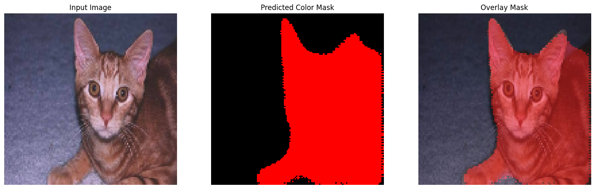
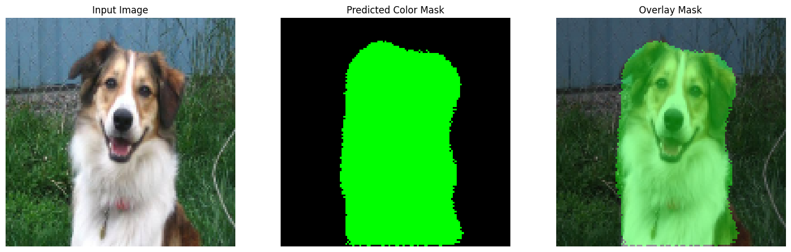

# Cat and Dog Segmentation Final Project

Welcome to the Cat and Dog Segmentation Final Project! This repository contains code, models, and resources for performing semantic segmentation on images to distinguish between cats, dogs, and background.

## Table of Contents

- [Project Overview](#project-overview)
- [Project Workflow](#project-workflow)
- [Dataset](#dataset)
- [Installation](#installation)
- [Local Fast API Usagee](#local-fast-api-usage)
- [Docker Deployment](#docker-deployment)
- [Results](#results)
- [Contributors](#contributors)
- [License](#license)

## Project Overview

This project aims to build and evaluate a deep learning model capable of segmenting cats and dogs from images. Semantic segmentation allows us to assign each pixel in an image to a specific class (cat, dog, or background), enabling precise identification and separation. It uses **U-Net architecture with a MobileNet model** through transfer learning approaches.

## Project Workflow

- **Preparation:**  
  Images of cats and dogs were **annotated using LabelMe**.  
  The annotations were then **converted into Pascal VOC format** and the segmentation masks were **encoded** for efficient training.

- **Model Architecture:**  
  Implemented **U-Net semantic segmentation architectures** with a **MobileNet** for transfer learning.

- **Deployment:**  
  The trained model was deployed using a **FastAPI backend** for making predictions.  
  To ensure portability and scalability, the entire one was **containerized with Docker**, to be able to run across different environments.

## Dataset

The project uses a custom annotated dataset containing cats and dogs. Please refer to the [data/](dataset/cat_and_dog_dataset) folder for instructions on downloading and structuring the dataset.

## Installation

1. **Clone the repository:**

   ```bash
   git clone https://github.com/ML-Summer-School-by-WAI/Practical-ML-by-WAI.git
   cd 8_final_proj/Team_TKH
   ```

2. **Install dependencies:**

   ```bash
   pipenv install
   pipenv shell
   ```

3. **Start Jupyter Notebook: (OPTIONAL)**
   ```bash
   jupyter notebook
   ```

## Local Fast API Usage

1. **Change Folder Path:**

   ```bash
   cd 8_final_proj/Team_TKH/api
   ```

2. **Install dependencies:**

   ```bash
   pipenv install
   pipenv shell
   ```

3. **Run Fast API:**

   ```bash
   uvicorn main:app --reload
   ```

4. **API ENDPOINT**
Open Browser
   ```bash
   http://127.0.0.1:8888/docs or update as you prefer to use different port
   ```

API EndPoint - `/predict`

## Docker Deployment

## Results

You can find sample results and visualizations in the [results/](results/) directory.


_Figure 1 - Predicted Mask for Cat_

---


_Figure 2 - Predicted Mask for Dog_

---

## Contributors

- [Thin Nandar Aung](https://github.com/ThinNandarAung-dev-prog)
- [Kaung Khant Paing](https://github.com/kKhantPaing)
- [Hein Naing Aung](https://github.com/HeinNaing)

## License

This project is licensed under WAI and developed as educational purpose.

---

**Final-Group-Project-WAI**  
Cat and Dog Semantic Segmentation  
2025
